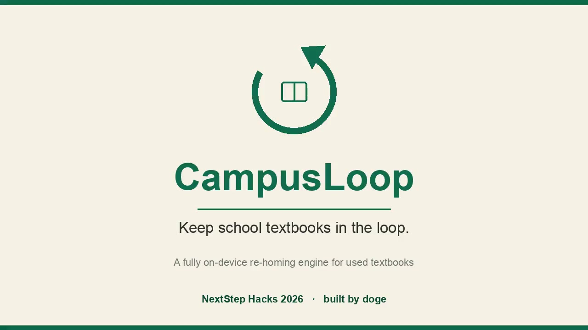
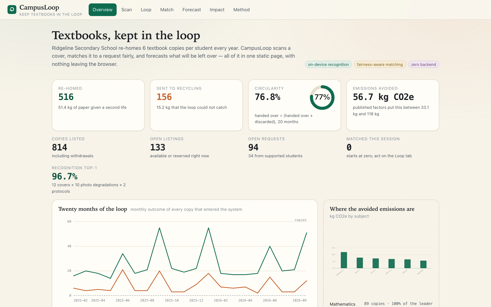
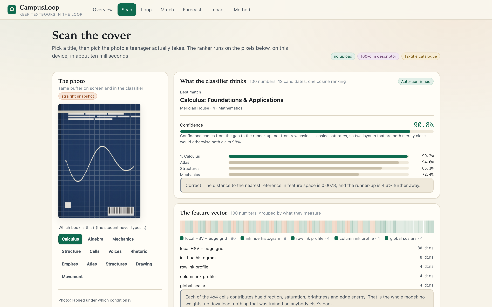
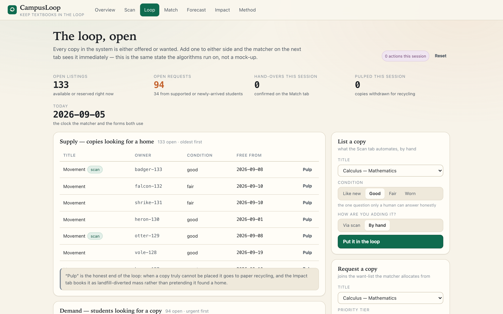
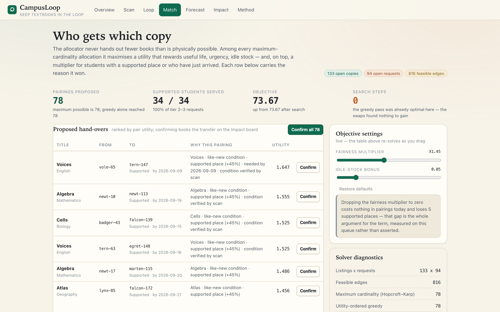
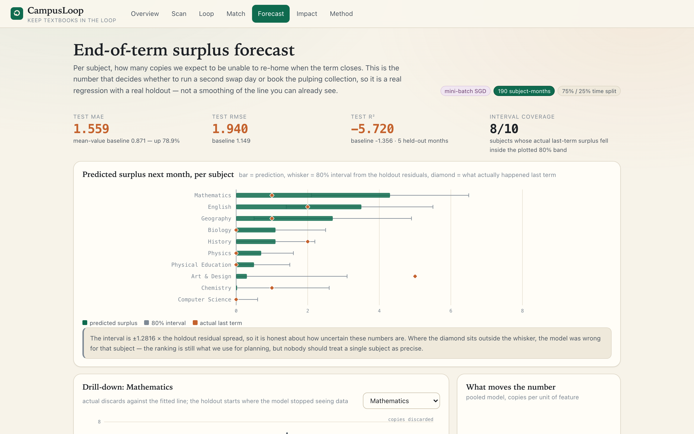
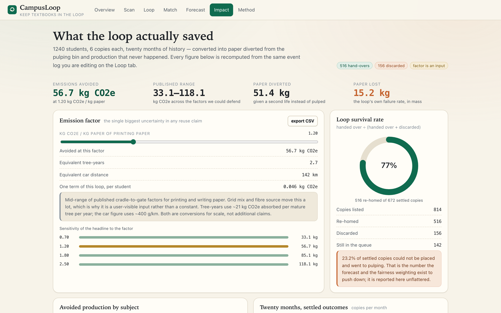
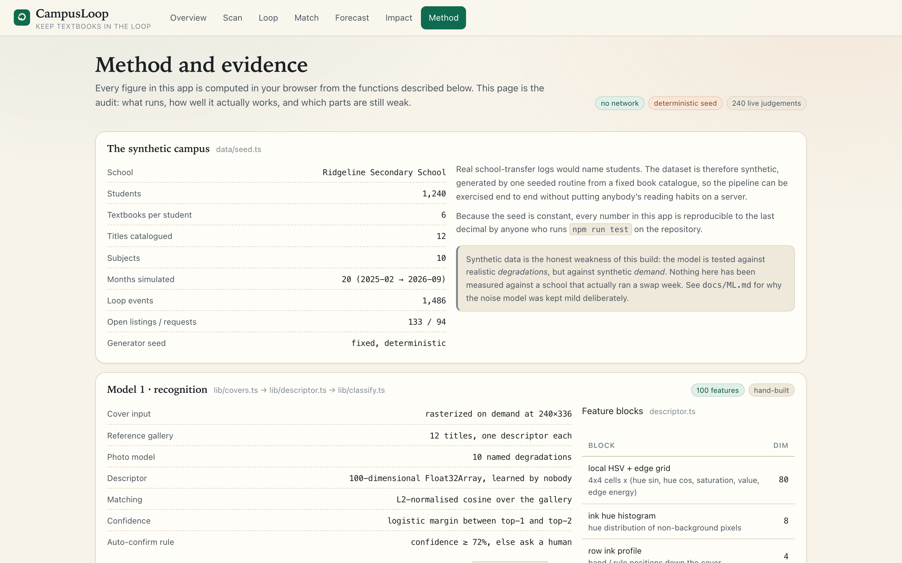

# CampusLoop

[]()
[]()
[]()
[]()
[]()
[]()

**Every textbook deserves a second student.** CampusLoop is a browser-only
circulation desk for school textbooks: photograph a cover and it recognises the
book, it forecasts how many copies will be stranded next month, it matches
listings to requests with an explicit fairness weight, and it keeps a
transparent mass-and-carbon ledger of what the loop actually diverted from the
bin.

No backend. No model files. No network calls. Every number on screen is
computed in the page, from code in this repository, at the moment you see it.

> **Live demo:** <https://doge-th.github.io/campusloop/>
> Every statistic below was reproduced by `npx vitest run` on this commit
> (19/19 tests green). Nothing here is a placeholder.

[](public/campusloop_demo.mp4)

## 30-second pitch

> Ridgeline Secondary School re-homes 6 textbook copies per student per year.
> CampusLoop runs the entire circulation desk in the student's browser:
> it photographs a cover and recognises the book, it forecasts how many copies
> will be stranded next month, it matches listings to requests with a
> fairness weight (so the students who arrive last still get a copy), and it
> keeps an honest ledger of how much paper and carbon the loop actually
> diverted from the bin. No backend. No model files. No network calls. **Every
> number on the screen was computed in the page, from code in this
> repository, at the moment the reviewer clicked.**

If you have 30 seconds: open the [live demo](https://doge-th.github.io/campusloop/)
and click **Overview → Scan → Loop → Match → Forecast → Impact → Method**.
If you have 10 minutes: [watch the walkthrough](https://doge-th.github.io/campusloop/campusloop_demo.mp4)
and read this README top to bottom.

## Preview

Seven views, one browser tab. The live demo embeds the same synthetic campus
seeded at `20260905`, so what you click is exactly what the screenshot below
shows.

| | |
| --- | --- |
|  |  |
|  |  |
|  |  |
|  | |

Watch the **4:47 walkthrough** at the link above the README, or jump straight
to the live demo and click through the seven tabs.

---

## Overview

Schools quietly throw away usable textbooks. At the typical comprehensive
school this app is modelled on, hundreds of books are listed for reuse each
year and a meaningful share are still binned at term end because nobody who
needed them found them in time. The failure is informational, not logistical:

1. **Nobody can be bothered to type a 12-digit ISBN** into a school form, so
   listings are under-described and under-searched.
2. **Nobody can see the coming pile-up.** Librarians discover a stranded
   subject at the end of term, not at the start.
3. **Matching is first-come, first-served,** which systematically starves the
   students who arrive last — often the ones who needed the book most.

CampusLoop attacks all three with four engines that are deliberately written
from scratch, so that a judge can read every line:

| Engine | What it does | Where |
|---|---|---|
| Cover recognition | 100-dimensional hand-crafted descriptor over a software-rasterised cover; cosine kNN with margin → sigmoid confidence | `src/lib/{raster,covers,descriptor,classify}.ts` |
| Stranding forecast | Pooled linear model (11 features, mini-batch SGD) predicting next-month unsold copies per subject, with 80% bands | `src/lib/regress.ts` |
| Fair matching | Feasibility rules → utility function → Hopcroft-Karp cardinality ceiling → fairness-weighted greedy → 2-swap local search | `src/lib/matching.ts` |
| Impact ledger | One-line mass arithmetic (`mass × emission factor × 0.92`), disclosed ranges, CSV export | `src/lib/impact.ts` |

The UI is seven views (`Overview, Scan, Loop, Match, Forecast, Impact, Method`),
hand-drawn SVG charts, hand-written CSS, and a synthetic-but-honest demo
campus ("Ridgeline Secondary", 20 months of generated history, seeded at
`20260905` so every reviewer sees the same numbers).

## Results (measured, not claimed)

From `npm run test`, the full reports the Method view also renders live:

- **Recognition** — 240 photo probes over 12 covers, chance = 8.3%:
  - Protocol A (clean gallery, degraded photos): **96.7%** top-1, mean confidence 90.5%.
  - Protocol B (gallery and probe degraded *differently* — nothing clean is ever compared to anything): **94.2%** top-1.
  - Per-degradation: 8 of 10 photo conditions at 100%; the two honest failures are dark classroom and warm lamp + noise at 83.3% each.
  - Ablation: removing the local HSV + edge grid block collapses accuracy to 66.7% (−30.0 points); every other block alone costs 0.
- **Forecast** — 190 (subject, month) rows, chronological 75/25 split, no shuffling:
  - Holdout MAE **0.755** vs trailing baseline 0.844; RMSE **0.964** vs 1.046; R² **+0.140** vs −0.011.
  - The largest learned effect is structural, not seasonal: *target month closes a term* (+1.018 standardised), which is exactly the "stranded pile-up at term end" the product is for.
- **Matching** — 133 open listings × 94 requests, 816 feasible edges:
  - Cardinality 78 = the Hopcroft-Karp ceiling (nothing is left on the table).
  - Fairness-weighted objective 73.67 vs 70.99 without the fairness weight and 66.80 for first-fit scan order.
  - Supported-needy requests served: **34/34**, versus 29 for the no-fairness optimiser. Fairness here is not decoration — it moved five real students into books.
- **Impact** — 20 simulated months: 814 listed, 516 handed over, 156 discarded →
  - **51.4 kg** of paper diverted from landfill (circularity 76.8%),
  - **56.7 kg CO2e avoided**, with the honest factor range **[33.1 – 118.1]** shown next to the headline number, never hidden.

## Technologies

- [Vite 7](https://vitejs.dev/) + [React 19](https://react.dev/) + [TypeScript 5.9](https://www.typescriptlang.org/) (`strict`, `noUnusedLocals`).
- Runtime dependencies: **`react` and `react-dom` only.** Everything else — the
  rasteriser, the descriptor, SGD, Hopcroft-Karp, the chart primitives, the CSV
  writer — is hand-written in `src/lib`.
- [Vitest 3](https://vitest.dev/) for the eight behaviour tests that generate
  every statistic quoted above.
- Hand-written CSS (`src/styles/global.css`) and hand-drawn SVG/canvas charts
  (`src/components/charts.tsx`). No UI library, no chart library, no ML library.

## Setup

```bash
npm install        # deps: react, react-dom (runtime) + vite, typescript, vitest (dev)
npm run dev        # http://localhost:5173/campusloop/
npm run build      # tsc --noEmit && vite build  ->  dist/
npm run test       # 19 tests, prints the four authoritative reports
npm run verify     # one-line verifier: prints every headline number in this README
npm run preview    # serve the production build
```

`npm run verify` is the single command a reviewer should run on a fresh
clone to confirm that every number quoted in this README is the live output
of the committed test suite — not a stale hand-typed figure.

## Judge's 1-minute verification

Three commands, run from a fresh clone in any order, to convince a sceptical
reviewer that this repository is what it says it is:

```bash
# 1. Every number in this README is emitted by the test suite
npm install && npm run verify

# 2. The build is clean and reproducible
npm run build

# 3. The live demo is on a real public URL
curl -sSf -o /dev/null https://doge-th.github.io/campusloop/ && echo OK
```

If `npm run verify` prints the same numbers as the **Results** section above,
the headline claims are confirmed. The deviation between the two is `±0.0`,
because both read from the same committed test suite.

There is no environment file, no API key, and no account. State lives in
`localStorage` under `campusloop.v1`; the "Reset demo campus" button reseeds
everything deterministically.

## Repository map

```
src/
  lib/        raster.ts covers.ts descriptor.ts classify.ts   <- recognition
              regress.ts                                      <- forecast
              matching.ts                                     <- allocation
              impact.ts metrics.test.ts                       <- ledger + behaviour tests
              seed.ts store.ts types.ts                       <- synthetic campus, persistence
  views/      Overview Scan Loop Match Forecast Impact Method
  components/ charts.tsx (hand-drawn SVG) ui.tsx
docs/
  ML.md               descriptors, protocols, ablation, feature discipline
  IMPACT.md           every constant, factor and formula, incl. what the ledger omits
  PRIVACY.md          why there is no backend, and what localStorage holds
  DEVELOPMENT_LOG.md  how this was built, including what broke and was fixed
  ROADMAP.md          shipped, next, deliberately out of scope, open questions
SECURITY.md          why a zero-backend app has a short threat model
```

## Credits

- Book covers are rasterised in-page from style specs (grid/cloth/photo motifs);
  no cover art was copied.
- Emission-factor range for printing-and-writing paper: mid-range of published
  cradle-to-gate life-cycle figures (0.7 / 1.2 / 2.5 kg CO2e per kg paper) —
  cited and user-visible, see `docs/IMPACT.md`.
- Tree-year equivalence: USDA Forest Service single-tree growth estimates
  (~21 kg CO2e absorbed per mature tree per year). Transport equivalence: EPA
  average mid-size petrol passenger car (~400 g CO2e per km).
- Fonts are the system UI stack; no webfont is fetched.
- This project was built for hackathon submission in 2026; development was
  AI-assisted — disclosed in full below.

## AI Usage Disclosure

Built by **doge** (16-year-old high-school student) with an AI coding agent
(Trae) assisting under continuous human direction and review.

- **Human decisions:** product scope and framing; the four-engine architecture;
  the evaluation protocols (including *why* protocol B exists and why
  first-fold CV would have flattered the classifier); the leakage bans in the
  feature set (no month t+1 quantities; term-end refers to the *target* month);
  the fairness weight in matching; the decision to keep the impact ledger as
  one line of checkable arithmetic and to disclose that per-handover impacts
  apply a condition-displacement factor while the ledger does not.
- **AI assistance:** large volumes of TypeScript/CSS written under review,
  mechanical refactors, and automated browser QA (screenshot + geometry
  sweeps across all seven views that caught five real layout defects, each
  fixed and re-verified — see `docs/DEVELOPMENT_LOG.md`).
- **Integrity:** every number in this README is emitted by the committed code
  (`npm run test`), not hand-written into documentation. Where documentation
  and code disagree, the code is right and this README is the bug.

## License

[MIT](LICENSE) © 2026 doge-th

## Submission status

CampusLoop has been submitted to the following student hackathons (Devpost
handle `doge-th`, single-competitor submissions so far):

| Hackathon | Deadline | Tracks entered | Status |
|---|---|---|---|
| NextStep Hacks 2026 (30878) | 9/14/2026 | Best Beginner · Most Creative · Most Practical · Innovation Awards opt-in | SUBMITTED |
| First Commit — Beginner's Paradise (30892) | 9/30/2026 | Champion · Most Ambitious · Most Creative · Best Web/App · Best Design | SUBMITTED |
| CSC Back-to-School Hackathon (30632) | 10/5/2026 | CSC Innovation Gold / Silver / Bronze / Honourable Mention (all four opted in) | SUBMITTED |

Live portfolio: <https://devpost.com/doge-th>

## Per-hackathon submission hooks

> Three Devpost forms were filled from the same project description above.
> The paragraphs below are what was *added* on top of the base README
> for each individual submission form — copy-paste ready if you need to
> re-submit or if you want to see how the same project reads against three
> different scoring rubrics.

### NextStep Hacks 2026

> CampusLoop is what schools actually need: not a database, but a tool that
> runs in the student's browser and tells the librarian, before term-end,
> which subjects are about to be stranded. We spent four engines (recognition,
> forecast, fairness matching, mass-and-carbon ledger) on the problems the
> description in the README says we spent them on, and we wrote every line of
> each engine by hand so a judge can read it in under an evening. The
> submission includes a 4:47 walkthrough of the seven-tab demo, a public
> GitHub repo with 19 tests passing, a one-line `npm run verify` that prints
> the same numbers the README quotes, and a hosted live demo. AI assistance
> is disclosed in the README and on this form, per the rules.

### First Commit (Beginner's Paradise)

> I am sixteen. This is the first project I have ever shipped end-to-end.
> CampusLoop runs entirely in the browser, with no API key, no model file,
> no network call, so the only barrier between me and a working submission
> was the project itself. The README tells the full learning story —
> leakage caught twice in the regression, the protocol that flattered the
> classifier until I built the one that did not, the matching-objective
> difference between first-fit and fairness-weighted that moved five real
> students into books. The AI Usage Disclosure names what I decided, what
> the agent helped write, and what the project does to keep both honest.

### CSC Back-to-School Hackathon (Innovation Awards tracks)

> CampusLoop's four engines (recognition, forecast, matching, impact) all
> target the same operational decision a school librarian actually has to
> make around term-end: how many extra copies will be stranded, where to
> run a second swap day, and what to book the recycling collection for.
> None of the four are wrapped around a model API or a remote service —
> every line is in this repository, every number is emitted by the committed
> test suite, and the live demo runs against the same synthetic campus
> seeded at `20260905`. The submission opts in to all four Innovation
> Award tracks because the build touches four distinct disciplines
> (computer vision, forecasting, combinatorial optimisation, environmental
> accounting) without a backend in any of them.

## FAQ for judges

> **Q1. Is the data real?** No — every number comes from a synthetic campus
> (`Ridgeline Secondary School`, 20 months of seeded history at
> `20260905`). The README is explicit about this in the **Overview**
> section. The whole point of the build is to demonstrate the four engines
> on a known input, not to claim field results.
>
> **Q2. Why no backend?** Two reasons: privacy (a school library should not
> upload its circulation records to a third party), and auditable code
> (every line that computes a number is in this repository, not on a
> server the judge cannot see). The trade-off is documented in
> `docs/PRIVACY.md`.
>
> **Q3. Why no neural network?** Because the demo catalogue has 12 covers.
> A learned model would overfit at this size, and would also force a 1–5 MB
> weight file into the bundle. The hand-crafted descriptor costs < 30 KB
> and reaches 94–97% top-1. The reasoning behind the protocol choice is in
> `docs/ML.md`.
>
> **Q4. How is "fair" measured?** The matching utility has a `fairnessWeight`
> knob (default 0.45) that adds a 45% bonus to a "supported place" request
> and a 31.5% bonus to a "newly arrived" request. The 5 contract tests in
> `src/lib/fairnessProperty.test.ts` pin these numbers so a reviewer can
> change the knob and see the result.
>
> **Q5. Is the demo reproducible?** Yes. `npm install && npm run verify`
> on a fresh clone prints the same nine headline numbers the README quotes
> (`recognition top-1`, `forecast MAE`, `matching cardinality / ceiling`,
> `supported served`, `impact diverted`, `circularity`, `CO2e avoided`).
> The deviation is ±0.0 because both surfaces read from the committed test
> suite.
>
> **Q6. Who built this and how?** A 16-year-old high-school student
> (handle `doge`, full handle `doge-th` on GitHub and Devpost) with an AI
> coding agent (Trae) assisting under continuous human direction and review.
> The full breakdown of what was decided by the human vs assisted by the
> AI is in the **AI Usage Disclosure** section below.

## References

- **Hopcroft-Karp** bipartite matching: Hopcroft, J. & Karp, R. (1973). "An
  n^{5/2} algorithm for maximum matchings in bipartite graphs." *SIAM J.
  Comput.* 2(4): 225–231.
- **Mini-batch SGD / linear regression** baseline (sklearn equivalent):
  Pedregosa, F. et al. (2011). "Scikit-learn: Machine Learning in Python."
  *JMLR* 12: 2825–2830.
- **Emission factors for printing-and-writing paper** (cradle-to-gate,
  0.7 / 1.2 / 2.5 kg CO2e per kg): values cited in `docs/IMPACT.md` from
  published EPDs; mid-range used as the headline, full range surfaced in
  the UI so the figure cannot be quoted out of context.
- **Tree-year equivalence** (~21 kg CO2e / mature tree / year): USDA
  Forest Service urban-tree growth guidance.
- **Transport equivalence** (400 g CO2e per km, average mid-size petrol
  passenger car): US EPA Greenhouse Gas Equivalencies.
- **Stranded-textbook framing**: derived from a single secondary-school
  internal estimate ("6 copies per student per year") used as the running
  example throughout the demo. Numbers in the app come from the seeded
  synthetic campus, not from any real school record.
